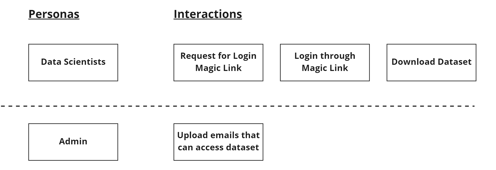
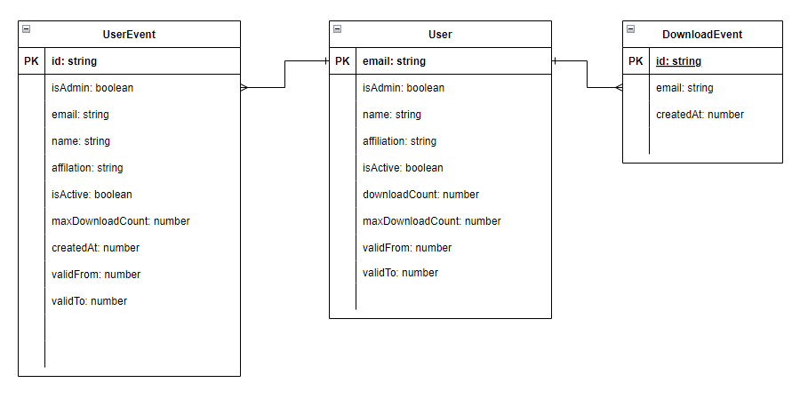
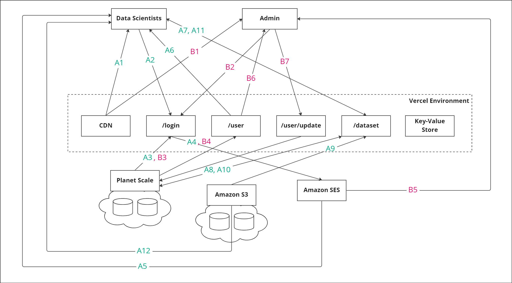

# Datamine
This is a project that leverages on Magic Links to distribute datasets to pre-approved entities.

## Table of Contents
-----
1. [System Design](#System-Design)
    * [DDD Strategic Design](#DDD-Strategic-Design)
    * [DDD Tactical Design](#DDD-Tactical-Design)
    * [API Endpoints](#API-Endpoints)
    * [Capacity Estimation](#Capacity-Estimation-(Data-Storage))
    * [Cost Estimation](#Cost-Estimation)
    * [System Architecture](#System-Architecture)

## System Design
-----

### __DDD Strategic Design__

_The goal of strategic design is to formalize the language between stakeholders and can be categorized into 3 categories: __(1) Events; (2) Objects; (3) Transactions__._

_Events represent the past and act as the source of truth; they are stored in databases. Objects are models that represent the current state of the domain and are derived from the events that occur over time. Transactions work with objects within the domain to generate events that changes the various objects of the domain._

The domain of __```Datamine```__ is as follows:



| Events        | Objects       | Transactions
| ---           | ---           | ---
| UserUpdated   | User          | UpdateUser
| Download      | -             | DownloadDataset

The datasets are uploaded in an out-of-band manner by system administrators and is not within the scope of this project.

### __DDD Tactical Design__



Based on the events and objects identified in the _Strategic Design_ stage, the above Entity-Relationship diagram is drawn.

### __API Endpoints__
```
POST /api/v1/login/       # body: { email: string }
POST /api/v1/user/update  # body: { ...<user_attributes> }
GET /api/v1/user/?email={string}
GET /api/v1/dataset/
```
The endpoinds are derived from the needs of the personas identified in the _Strategic Design_ stage.
### __Capacity Estimation__ (Data Storage)

* __Int__: 4 bytes
* __Char__: 2 byte * size
* __Bool__: 1 byte
* __UserUpdatedEvent__: (32 bytes * 2 * 4) + (4 bytes * 4) + 2 bytes = 274 bytes
* __DownloadEvent__: (32 bytes * 2 * 2) + 4 bytes = 132 bytes

Assuming _100_ user updates per day, the database growth rate can be calculated as follows:

* 100 * (274 + 132) bytes
= __40.6KB / day__

By using Planet Scale database service, there is 5GB of storage available in the free tier:

* 5,000,000 KB / 40.6 KB = ~120,000 days = __~300 years sustained usage__

### __Cost Estimation__

__Assumptions:__
- Developer team size: 1 pax
- 100 daily active users
- 100 user updates per day
- 100 downloads per day
- 1 compressed dataset of size 40 GB that never changes
- 100 emails sent per day
- 1 GB of monthly email data sent 


__[Vercel Monthly Cost](https://vercel.com/pricing)__

| Type   | Cost (per month)
| ---    | ---
| __Hobby__  | __0.00 USD__
| Pro    | 20.00 USD per team member (max 10)

__[Planet Scale Monthly Cost](https://planetscale.com/pricing)__

| Type      | Cost (per month)
| ---       | ---
| __Free__      | __0.00 USD__
| Scalar    | 29.00 USD

__[Amazon S3 Monthly Cost](https://calculator.aws/#/addService/S3)__

| Type        | Calculation | Cost (per month)
| ---         | --- | ---
| Storage     | 40 GB * 0.025 USD | __1.00 USD__
| PUT request | 1 PUT Request * 0.000005 USD per request | __0.00 USD__
| GET request | (100 downloads per day) * (30 days) * (0.0000004 USD per request) | __0.0012 USD__
| Total       | 1.00 USD + 0.0012 USD | __1.00 USD__

__[Amazon SES Monthly Cost](https://calculator.aws/#/addService/SES)__

| Type          | Calculation | Cost (per month)
| ---           | --- | ---
| No. of Emails | 100 emails per day * 30 days x 0.0001 USD | __0.30 USD__
| Data sent     | 1 GB per month x 0.12 USD | __0.12 USD__
| Total         | 0.30 USD + 0.12 USD | __0.42 USD__

### __System Architecture__


### Data Scientist Flow

__A1__: User visits the WebApp hosted on Vercel's Content Distribution Network.

__A2__: User logins by entering their email address.

__A3__: System verifies if the email is valid by referencing the database, and generates a Magic Link.

__A4__: Upon successful validation, system triggers an email containing the Magic Link to the WebApp.

__A5__: User recieves the Magic Link in their mailbox and uses it to sign in to the WebApp.

__A6__: Upon clicking on a valid Magic Link, the user will be greeted with their profile information and a download dataset button.

__A7__: User triggers the download datasets.

__A8__: System validates the download request.

__A9__: System generates a short-lived pre-signed S3 URL.

__A10__: System generates a new DownloadEvent, updating the download count.

__A11__: System forwards the pre-signed S3 URL to the user.

__A12__: User downloads the dataset using the given URL.

### Admin Flow

__B1__: User visits the WebApp hosted on Vercel's Content Distribution Network.

__B2__: User logins by entering their email address.

__B3__: System verifies if the email is valid by referencing the database, and generates a Magic Link.

__B4__: Upon successful validation, system triggers an email containing the Magic Link to the WebApp.

__B5__: User recieves the Magic Link in their mailbox and uses it to sign in to the WebApp.

__B6__: Upon clicking on a valid Magic Link, the user will be directed to the admin panel of the WebApp.

__B7__: User uploads csv file containing the list of users who can download the dataset.
